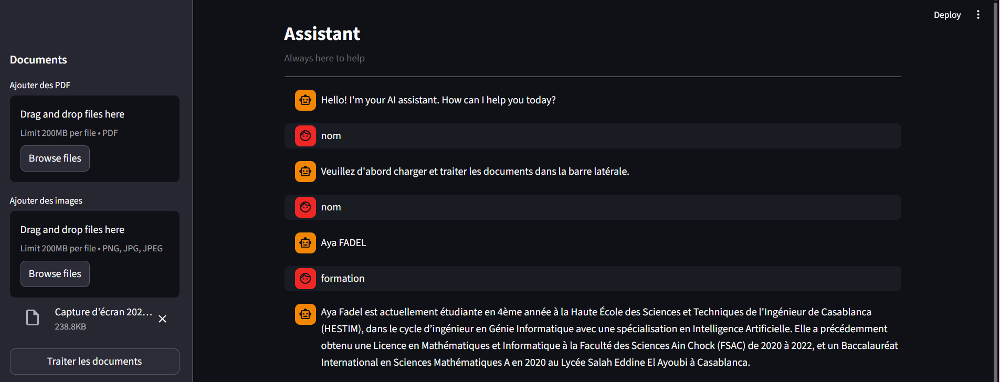

# Multimodal RAG AI Assistant

A **multimodal AI assistant** based on **Retrieval-Augmented Generation (RAG)**, built with **Streamlit, LangChain, ChromaDB, and OpenAI**.

This application allows users to upload **PDF documents and images**, extract their textual content, transform it into embeddings, store it in a **vector database**, and ask questions through an interactive chat interface.

The assistant retrieves the most relevant content from the uploaded files and generates contextual answers using an **LLM**.

---

## Description

The goal of this project is to build a simple and interactive **multimodal RAG system** capable of understanding information coming from different document types.

The application supports:

- **PDF documents**, from which text is extracted directly
- **Images**, from which text is extracted using **OCR**

Once the content is extracted:

1. The text is split into smaller chunks
2. Embeddings are generated using **OpenAI**
3. The embeddings are stored in **ChromaDB**
4. A retriever selects the most relevant chunks for the user’s query
5. The language model generates a contextual response in a chat interface

This project is useful for building an intelligent assistant able to answer questions based on user-provided documents instead of relying only on general knowledge.

---

## Screenshot



---

## Features

- Upload multiple **PDF documents**
- Upload **images**
- Extract text from PDFs
- Extract text from images using **OCR**
- Automatic **text chunking**
- Generate **OpenAI embeddings**
- Store embeddings in **Chroma vector database**
- Retrieve the most relevant document chunks
- Generate answers with **OpenAI LLM**
- Interactive **chat interface**
- Persistent **chat history**
- Clean chat-style UI with input bar at the bottom

---

## Architecture

```text
User
  ↓
Upload PDF / Images
  ↓
Text Extraction
  ├── PDF → PyPDF2
  └── Images → OCR with pytesseract
  ↓
Text Chunking
  ↓
Embeddings Generation (OpenAI)
  ↓
Chroma Vector Database
  ↓
Retriever
  ↓
LLM (OpenAI)
  ↓
Generated Answer in Chat Interface

```

# Tech Stack

- Python
- Streamlit
- LangChain
- OpenAI API
- ChromaDB
- PyPDF2
- pytesseract
- Pillow

---
## Project Structure

```text
multimodal-rag-ai-assistant
│
├── ragmultiple.py        # Main Streamlit application (RAG pipeline + UI)
├── README.md             # Project documentation
├── requirements.txt      # Python dependencies
├── pyproject.toml        # Project configuration
├── uv.lock               # Dependency lock file
├── image.png             # Application screenshot
│
├── .gitignore            # Git ignored files
├── .python-version       # Python version used
│
├── .env                  # Environment variables (NOT pushed to Git)
└── .venv                 # Virtual environment (NOT pushed to Git)

```
## Installation

Follow the steps below to set up the project locally.

### 1. Clone the repository

```bash
git clone https://github.com/yayaSB/multimodal-rag-ai-assistant.git
cd multimodal-rag-ai-assistant
```
### 2. Create a virtual environment

#### On Windows

```bash
python -m venv .venv
.venv\Scripts\activate
```
### 3. Install project dependencies

Install all required Python packages using `requirements.txt`.

```bash
pip install -r requirements.txt
```
### 4. Install Tesseract OCR

This project uses **pytesseract** to extract text from images.  
To enable OCR functionality, you must install **Tesseract OCR** on your system.

Download and install Tesseract from the official repository:

```text
https://github.com/tesseract-ocr/tesseract
```
### 5. Configure environment variables

To use the OpenAI API, you need to configure your **API key**.

Create a `.env` file in the root directory of the project and add the following variable:

```env
OPENAI_API_KEY=your_openai_api_key_here